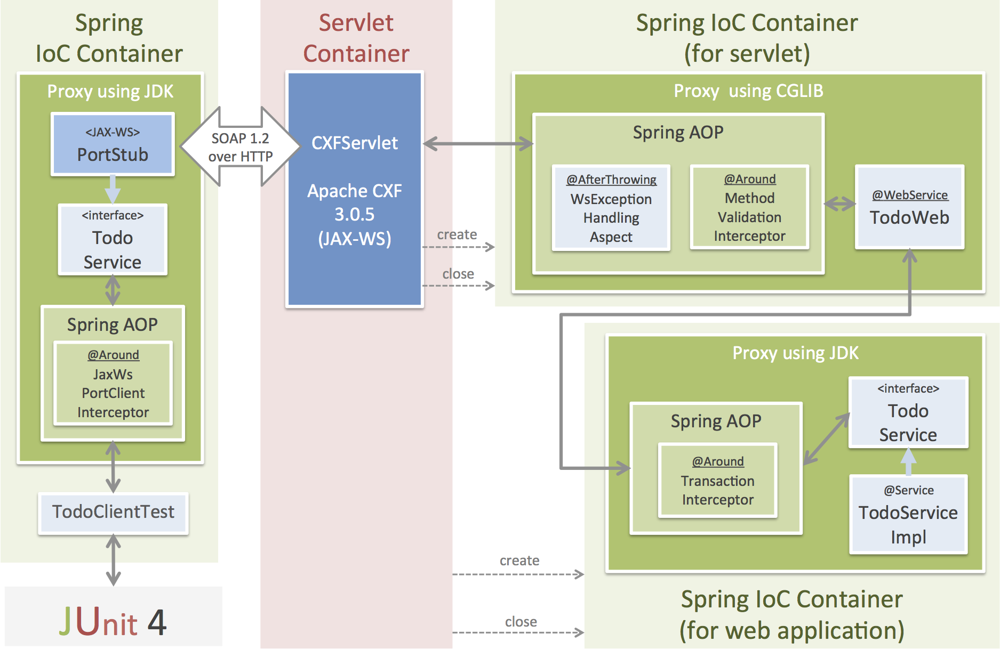
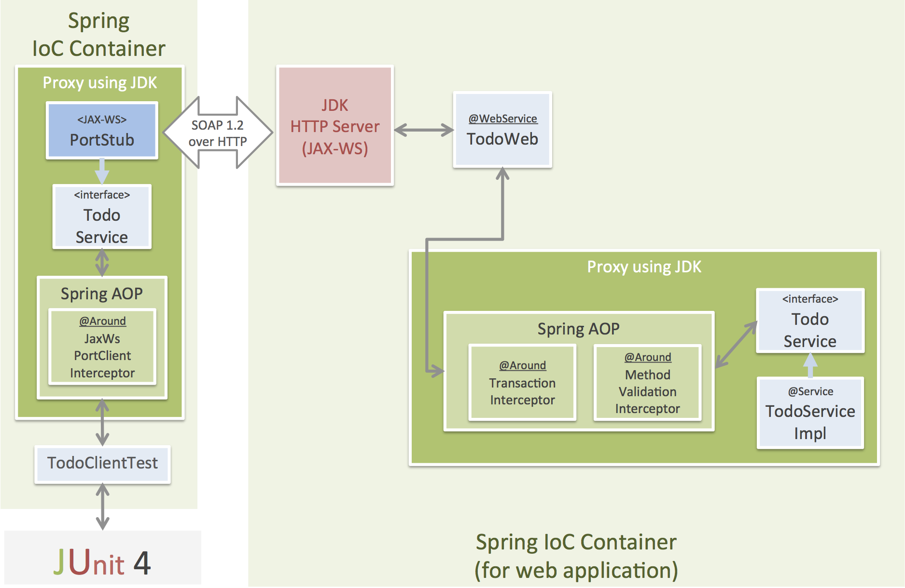

# The Sample Application of JAX-WS with Spring Framework

This project provide two sample application.

* Using Spring Framework + JAX-WS(Apache CXF)
* Using Spring Framework + JAX-WS(JDK HTTP Server)

## The main framework and library

This Sample applications use the TERASOLUNA Server Framework for Java (5.x).

* Spring Framework 4.1.4.RELEASE
* Bean Validation (Hibernate Validator 5.1.3.Final)
* etc ...

> **Note:**
>
> In this application, depends on lombok for automatically generate a methods(getter/setter/etc ...) of JavaBean.
> **If you are use IDE as Eclispe or STS(Spring Tool Suite) or IDEA or NetBeans, please  install lombok.jar to the IED. In detail of how to install, please see [here](http://jnb.ociweb.com/jnb/jnbJan2010.html#installation).** (If IDEA , please install lombok plugin)


## The Sample Application using Apache CXF

### Additional library

* Apache CXF 3.1.0 (JAX-WS platform)


### Application Structure overview




> **Todo:**
> 
> Details are written later ...


### Run and test an application

Run an application.

```console
cd soap-spring-with-cxf
mvn clean tomcat7:run
```

Test an application.

```console
cd soap-spring-with-cxf
mvn clean test
```


## The Sample Application using JDK HTTP Server

### Additional library

* None

### Application Structure overview




> **Todo:**
> 
> Details are written later ...


### Run and test an application

Run an application.

```console
cd soap-spring-with-jdk
mvn clean tomcat7:run
```

Test an application.

```console
cd soap-spring-with-jdk
mvn clean test
```

> **Warning:**
> 
> Currently, a validationErrorAtMethodArgument test is failing.
> It's under investigation.
