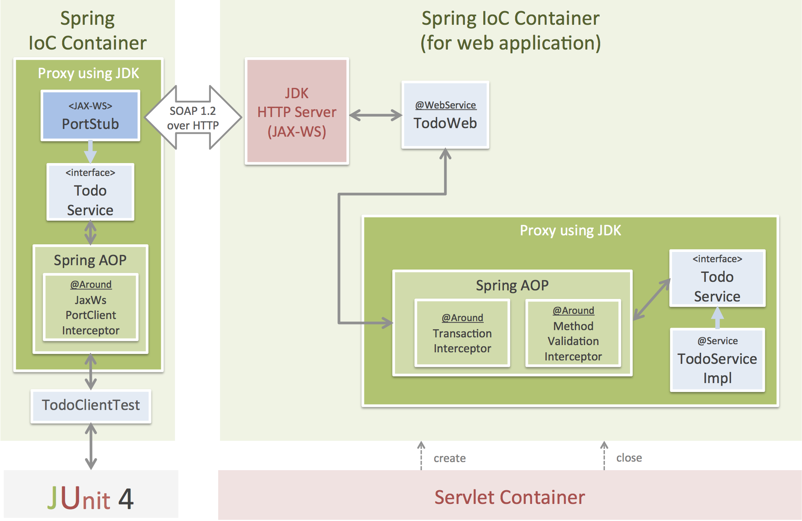

# The Sample Application of JAX-WS with Spring Framework

This project provide two sample application.

* Using Spring Framework + JAX-WS(Apache CXF)
* Using Spring Framework + JAX-WS(JDK HTTP Server)

## The main framework and library

This Sample applications use the TERASOLUNA Server Framework for Java (5.x).

* Spring Framework 4.1.4.RELEASE
* Bean Validation (Hibernate Validator 5.1.3.Final)
* etc ...

## The Sample Application using Apache CXF

### Additional library

* JAX-WS (Apache CXF 3.0.5)

> **Note:**
>
> Apache CXF 3.1.0 does not work. For detail, please refer to the [CXF-6428](https://issues.apache.org/jira/browse/CXF-6428).

### Application Structure overview

> **Note:**
> 
> Details are written later ...

## The Sample Application using JDK HTTP Server

### Additional library

* None

### Application Structure overview

> **Note:**
> 
> Details are written later ...
