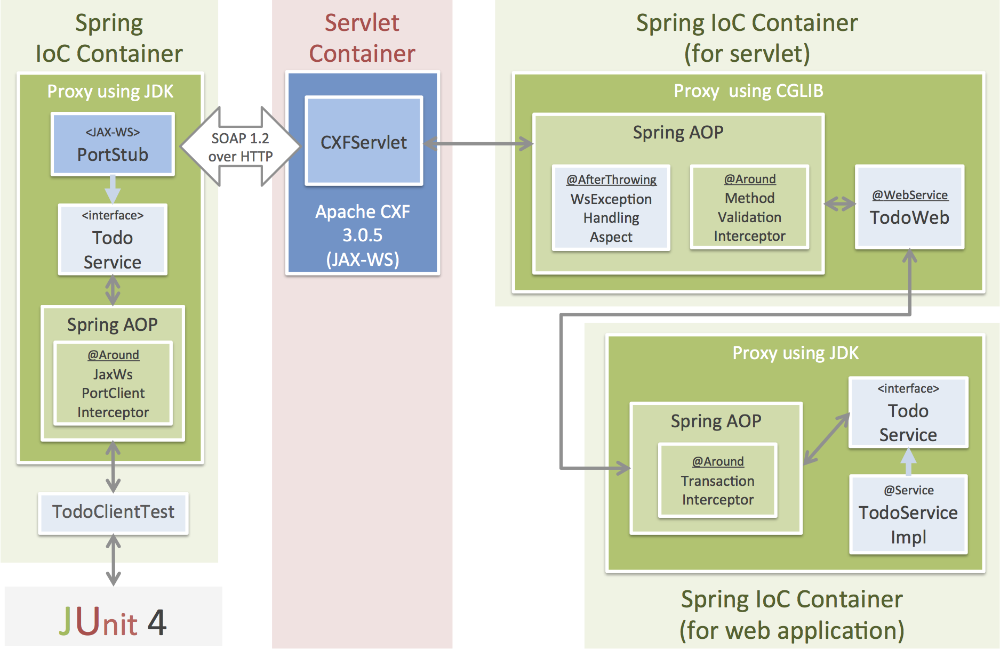

# The Sample Application of JAX-WS with Spring Framework & the Apache CXF

## The main framework and library

* Spring Framework 4.1.4.RELEASE
* JAX-WS (Apache CXF 3.0.5)
* Bean Validation (Hibernate Validator 5.1.3.Final)

## Application Structure overview

> **Note:**
> 
> Details are written later ...
